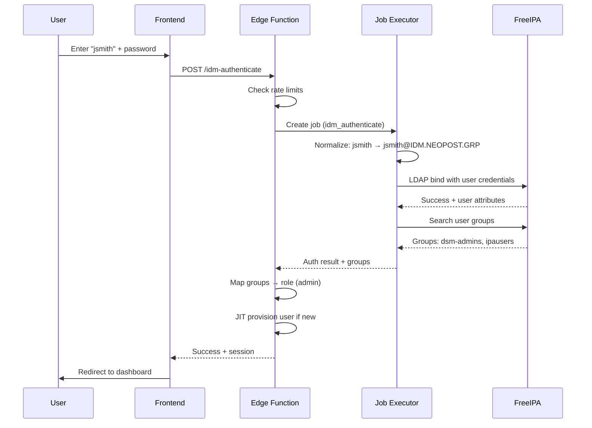
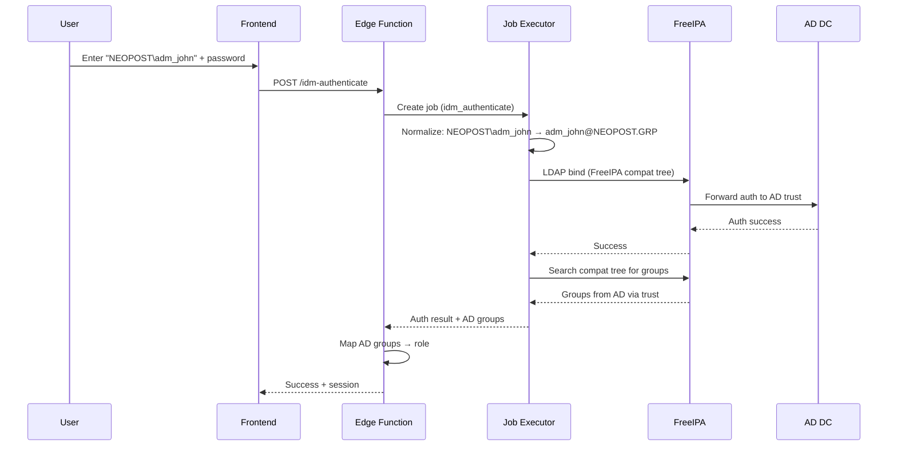
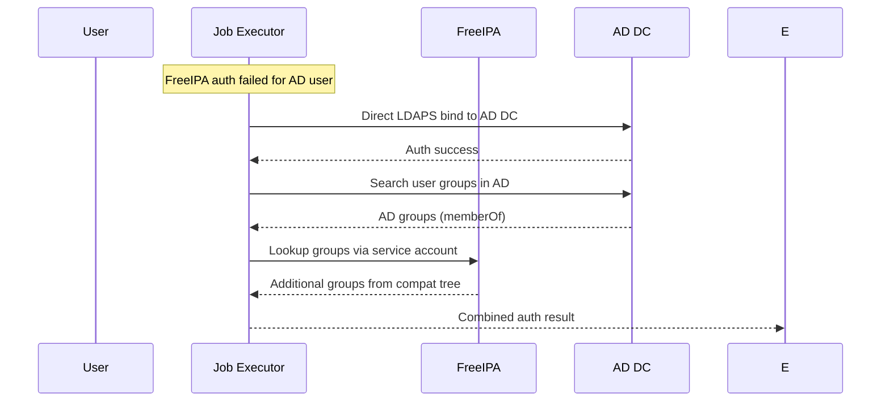

# IdM/FreeIPA Authentication Guide

This guide covers the configuration and usage of Identity Management (IdM) authentication in Dell Server Manager, including FreeIPA native users and Active Directory trust users.

## Architecture Overview

```
┌─────────────────┐      ┌──────────────────┐      ┌─────────────────┐
│   Auth.tsx      │      │  Edge Function   │      │  Job Executor   │
│   (Frontend)    │─────▶│  idm-authenticate│─────▶│  idm.py handler │
└─────────────────┘      └──────────────────┘      └────────┬────────┘
                                                           │
                         ┌─────────────────────────────────┴─────────────────────────────────┐
                         │                                                                   │
                         ▼                                                                   ▼
              ┌──────────────────┐                                              ┌──────────────────┐
              │    FreeIPA       │                                              │   AD Domain      │
              │  idm.neopost.grp │◀── AD Trust ──▶                              │   Controller     │
              │                  │                                              │  (Pass-through)  │
              └──────────────────┘                                              └──────────────────┘
                         │
           ┌─────────────┼─────────────┐
           │             │             │
           ▼             ▼             ▼
    ┌────────────┐ ┌────────────┐ ┌────────────┐
    │ NEOPOST.GRP│ │ NEOPOST.AD │ │IDM.NEOPOST │
    │  (AD Trust)│ │ (AD Trust) │ │   .GRP     │
    └────────────┘ └────────────┘ └────────────┘
```

### Component Responsibilities

| Component | Role |
|-----------|------|
| **Auth.tsx** | Login UI with FreeIPA/AD tab |
| **idm-authenticate** (Edge Function) | Job orchestration, JIT provisioning, role mapping |
| **idm.py** (Job Executor) | Actual LDAP/FreeIPA authentication |
| **ldap_auth.py** | LDAP connection and identity normalization |
| **identity.py** | Identity normalization across formats |

## Supported Identity Formats

Users can authenticate using any of these formats:

| Format | Example | Description |
|--------|---------|-------------|
| Bare username | `jsmith` | Tries domains in priority order |
| UPN format | `jsmith@neopost.grp` | User Principal Name |
| NT-style | `NEOPOST\jsmith` | Windows domain format |
| Full UPN | `jsmith@NEOPOST.GRP` | With uppercase realm |

### Domain Resolution Order

For bare usernames, the system tries domains in this order:
1. `NEOPOST.GRP` (first trusted AD domain)
2. `NEOPOST.AD` (second trusted AD domain)
3. `IDM.NEOPOST.GRP` (native FreeIPA)

## Configuration

### 1. IdM Connection Settings

Navigate to **Settings → Identity Management → Connection** and configure:

```yaml
# FreeIPA Server
Server Host: idm.neopost.grp
Base DN: dc=idm,dc=neopost,dc=grp
Bind DN: uid=svc_dsm,cn=users,cn=accounts,dc=idm,dc=neopost,dc=grp
Bind Password: [service account password]

# LDAP Security
Use LDAPS: Yes
LDAPS Port: 636
Verify Certificate: Yes (recommended for production)
CA Certificate: [paste CA cert if using private CA]

# Trusted AD Domains (comma-separated)
Trusted Domains: neopost.grp, neopost.ad

# AD Domain Controller (for direct pass-through)
AD DC Host: dc01.neopost.ad
AD DC Port: 636
Use LDAPS for AD DC: Yes
```

### 2. Group-to-Role Mappings

Navigate to **Settings → Identity Management → Role Mappings** and create mappings:

| IDM Group | App Role | Priority | Description |
|-----------|----------|----------|-------------|
| `cn=dsm-admins,cn=groups,cn=accounts,dc=idm,dc=neopost,dc=grp` | admin | 1 | Full admin access |
| `NEOPOST\server-admins` | admin | 2 | AD admins group |
| `cn=dsm-operators,cn=groups,cn=accounts,dc=idm,dc=neopost,dc=grp` | operator | 10 | Server operators |
| `NEOPOST-AD\infra-team` | operator | 11 | AD operators from NEOPOST.AD |
| `cn=dsm-readonly,cn=groups,cn=accounts,dc=idm,dc=neopost,dc=grp` | viewer | 100 | Read-only access |

**Note:** Lower priority number = higher precedence. First matching group wins.

### 3. Security Policies

Configure in **Settings → Identity Management → Security**:

```yaml
Max Failed Attempts: 5
Lockout Duration: 30 minutes
Session Timeout: 480 minutes (8 hours)
```

## Authentication Flows

### Native FreeIPA User



### AD Trust User (via FreeIPA)



### AD Trust User (Direct AD DC Pass-through)

When FreeIPA trust doesn't work or for specific AD forests:



## Test Scenarios

### 1. Native FreeIPA User

```bash
# Test user: svc_dsm (FreeIPA service account)
Username: svc_dsm
Expected realm: IDM.NEOPOST.GRP
Expected groups: cn=dsm-admins,...
Expected role: admin (if mapped)
```

### 2. AD Trust User (NEOPOST.GRP)

```bash
# Test user: AD admin from NEOPOST.GRP forest
Username: NEOPOST\adm_jsmith
# OR
Username: adm_jsmith@neopost.grp

Expected realm: NEOPOST.GRP
Expected groups: server-admins, domain-users
Expected role: admin (if mapped)
```

### 3. AD Trust User (NEOPOST.AD)

```bash
# Test user: AD user from NEOPOST.AD forest
Username: adm_jalexander@neopost.ad

Expected realm: NEOPOST.AD
Expected groups: infra-team
Expected role: operator (if mapped)
```

### 4. Lockout Test

```bash
# Attempt 5+ wrong passwords
# Expected: Account locked for 30 minutes
# API returns: { lockout_remaining_seconds: 1800 }
# UI shows: "Account locked. Try again in X minutes."
```

### 5. Server Offline Test

```bash
# Stop FreeIPA server
# Expected: Clean error message
# UI shows: "Unable to connect to identity server. Please contact support."

# AD DC offline but FreeIPA up
# Expected: FreeIPA users work, AD users get clean error
```

## Troubleshooting

### Common Issues

#### "Socket connection error while opening: timed out"

**Cause:** Network connectivity issue to IdM/AD server.

**Solutions:**
1. Verify server hostname/IP is correct
2. Check port is open: `nc -zv idm.neopost.grp 636`
3. Check firewall rules
4. Try LDAP (389) instead of LDAPS (636) temporarily

#### "Invalid credentials"

**Cause:** Wrong password or username format.

**Solutions:**
1. Verify username format (try all formats)
2. Check if account is locked in IdM/AD
3. Verify user exists in correct realm

#### "User not found in directory"

**Cause:** User exists in AD but not visible via FreeIPA compat tree.

**Solutions:**
1. Check AD trust is configured correctly
2. Try direct AD DC pass-through
3. Verify user is in a trusted domain

#### Groups Not Mapping Correctly

**Cause:** Group name format mismatch.

**Solutions:**
1. Check group mapping uses correct format:
   - Full DN: `cn=admins,cn=groups,...`
   - NT-style: `DOMAIN\groupname`
   - Simple: `groupname`
2. Verify group exists in user's group list
3. Check mapping priority order

### Debug Logging

Enable verbose logging in Job Executor:

```bash
# Set log level in activity_settings
UPDATE activity_settings SET log_level = 'DEBUG';
```

View logs:
- **Activity Monitor → Commands**: Shows LDAP operations
- **Activity Monitor → Jobs**: Shows job execution details
- **Job Executor console**: Real-time authentication attempts

### Test Authentication Tool

Use the "Test Authentication" feature in **Settings → Identity Management → Connection**:

1. Enter test credentials
2. Click "Test Auth"
3. View detailed results:
   - Connection status
   - Bind success/failure
   - User attributes found
   - Groups retrieved
   - Simulated role mapping

## Security Considerations

### Credential Storage

- Service account password is encrypted using AES-256
- User passwords are never stored, only passed through during auth
- Passwords are cleared from job details immediately after use

### TLS/SSL

- **Always use LDAPS** (port 636) in production
- Configure CA certificate for private CAs
- Enable certificate verification

### Rate Limiting

- Prevents brute force attacks
- Configurable max attempts and lockout duration
- Per-user + per-IP tracking

### Audit Logging

All authentication events are logged to `audit_logs`:
- Success/failure status
- User DN and groups at login
- Client IP address
- Timestamp

## Database Tables

| Table | Purpose |
|-------|---------|
| `idm_settings` | IdM connection configuration |
| `idm_group_mappings` | Group → Role mappings |
| `idm_auth_sessions` | Active IdM sessions |
| `profiles` | User profiles with IdM attributes |
| `user_roles` | User → App role assignments |
| `auth_rate_limits` | Rate limiting state |
| `audit_logs` | Authentication audit trail |

## API Reference

### POST /functions/v1/idm-authenticate

Authenticate a user via IdM/FreeIPA.

**Request:**
```json
{
  "username": "jsmith",
  "password": "secret"
}
```

**Success Response:**
```json
{
  "success": true,
  "user_id": "uuid",
  "email": "jsmith@neopost.grp",
  "idm_uid": "jsmith",
  "realm": "NEOPOST.GRP",
  "canonical_principal": "jsmith@NEOPOST.GRP",
  "groups": ["server-admins", "domain-users"],
  "role": "admin"
}
```

**Failure Response:**
```json
{
  "success": false,
  "error": "Invalid credentials",
  "remaining_attempts": 3
}
```

**Lockout Response:**
```json
{
  "success": false,
  "error": "Account temporarily locked",
  "remaining_attempts": 0,
  "lockout_remaining_seconds": 1800
}
```
