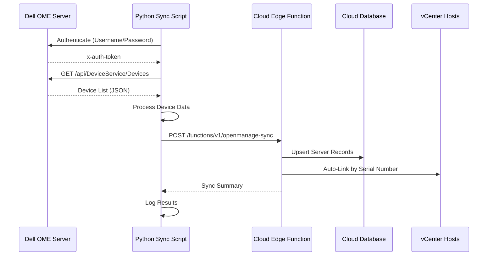

# Dell OpenManage Enterprise Integration Guide

This guide explains how to set up automatic server discovery and synchronization from Dell OpenManage Enterprise (OME) to your Dell Server Manager application.

## Table of Contents

1. [Overview](#overview)
2. [Prerequisites](#prerequisites)
3. [Architecture](#architecture)
4. [Configuration](#configuration)
5. [Manual Sync](#manual-sync)
6. [Automated Sync](#automated-sync)
7. [Auto-Linking with vCenter](#auto-linking-with-vcenter)
8. [Monitoring](#monitoring)
9. [Troubleshooting](#troubleshooting)
10. [Security Best Practices](#security-best-practices)
11. [API Reference](#api-reference)

---

## Overview

The Dell OpenManage Enterprise integration automatically discovers and syncs Dell servers from your on-premise OME server to the cloud-based Dell Server Manager application. This eliminates manual server inventory management and ensures your server data is always up-to-date.

### Key Features

- **Automatic Discovery**: Imports all Dell servers managed by OME
- **Daily Synchronization**: Keeps server inventory current with latest firmware and status
- **Auto-Linking**: Automatically correlates Dell hardware with vCenter VMs based on serial numbers
- **On-Premise Friendly**: Python script works behind corporate firewalls
- **Comprehensive Data**: Captures hardware specs, firmware versions, and health status
- **Audit Trail**: Every sync operation is logged for compliance

### How It Works

```
Dell OME (On-Premise) → Python Sync Script → Cloud Edge Function → Servers Table
                                                                  ↓
                                                            Auto-Link to vCenter Hosts
```

---

## Prerequisites

### OpenManage Enterprise Requirements

- **OME Version**: 9.0 or higher
- **Network Access**: HTTPS (port 443) from the sync script server to OME
- **OME Account**: Read-only account with permission to view devices

### Python Environment Requirements

- **Python Version**: 3.7 or higher
- **Required Libraries**: 
  ```bash
  pip install requests
  ```

### Application Requirements

- Admin access to Dell Server Manager Settings
- JWT authentication token (obtained from the application)

---

## Architecture

### Components

1. **OpenManage Settings Table**: Stores OME connection credentials in the cloud database
2. **OpenManage Sync Edge Function**: Cloud-based API endpoint that processes device data
3. **Python Sync Script**: On-premise script that fetches data from OME and sends to cloud
4. **Servers Table**: Stores synchronized server information
5. **Auto-Linking Logic**: Matches servers with vCenter hosts by serial number

### Data Flow



---

## Configuration

### Step 1: Configure OpenManage Settings in Web UI

1. Navigate to **Settings** → **OpenManage** tab
2. Enter your OpenManage Enterprise details:
   - **Host**: OME server hostname or IP (e.g., `openmanage.example.com`)
   - **Port**: HTTPS port (default: `443`)
   - **Username**: OME admin or read-only account
   - **Password**: OME account password
   - **Verify SSL Certificate**: Enable for production (disable for self-signed certs)
   - **Enable Daily Sync**: Toggle for automated daily synchronization
3. Click **Save Settings**

### Step 2: Download and Install Python Sync Script

1. Download the sync script to your on-premise server:
   ```bash
   curl -O https://your-app-url/openmanage-sync-script.py
   # Or download from your repository
   ```

2. Make it executable (Linux/Mac):
   ```bash
   chmod +x openmanage-sync-script.py
   ```

3. Install Python dependencies:
   ```bash
   pip install requests
   ```

### Step 3: Configure Environment Variables

Create a `.env` file or set environment variables:

```bash
# Dell OpenManage Enterprise Settings
export OME_HOST="openmanage.example.com"
export OME_PORT="443"
export OME_USERNAME="readonly_user"
export OME_PASSWORD="your_secure_password"
export OME_VERIFY_SSL="true"  # Set to "false" for self-signed certs

# Dell Server Manager Cloud Settings
export DSM_URL="https://your-app.lovableproject.com"
export DSM_JWT_TOKEN="your_jwt_token_here"
```

### Step 4: Obtain JWT Token

To get your JWT authentication token:

1. Log in to Dell Server Manager application
2. Open browser Developer Tools (F12)
3. Go to **Application** → **Local Storage**
4. Find the `supabase.auth.token` entry
5. Copy the JWT token value
6. Set it as the `DSM_JWT_TOKEN` environment variable

**Note**: JWT tokens expire. You'll need to update this periodically (typically every 7 days).

---

## Manual Sync

### Running the Sync Script Manually

Execute the script from the command line:

```bash
# Using environment variables
python3 openmanage-sync-script.py

# Or with inline variables
OME_HOST="openmanage.example.com" \
OME_USERNAME="admin" \
OME_PASSWORD="password" \
DSM_URL="https://your-app.com" \
DSM_JWT_TOKEN="your_token" \
python3 openmanage-sync-script.py
```

### Expected Output

```
[2025-11-06 14:30:00] ============================================================
[2025-11-06 14:30:00] Starting Dell OpenManage Enterprise Sync
[2025-11-06 14:30:00] ============================================================
[2025-11-06 14:30:00] OME Host: openmanage.example.com:443
[2025-11-06 14:30:00] DSM URL: https://your-app.com
[2025-11-06 14:30:00] Verify SSL: True
[2025-11-06 14:30:00]
[2025-11-06 14:30:00] Authenticating with OpenManage Enterprise...
[2025-11-06 14:30:01] Successfully authenticated with OpenManage Enterprise
[2025-11-06 14:30:01] Fetching devices from OpenManage Enterprise...
[2025-11-06 14:30:03] Retrieved 45 devices from OpenManage Enterprise
[2025-11-06 14:30:03] Processing device information...
[2025-11-06 14:30:04] Processed 45 devices successfully
[2025-11-06 14:30:04] Syncing 45 devices to cloud...
[2025-11-06 14:30:08] ✓ Sync completed successfully!
[2025-11-06 14:30:08]   Total devices: 45
[2025-11-06 14:30:08]   New servers: 3
[2025-11-06 14:30:08]   Updated servers: 42
[2025-11-06 14:30:08]   Auto-linked: 40
[2025-11-06 14:30:08]   Errors: 0
[2025-11-06 14:30:08]
[2025-11-06 14:30:08] ============================================================
[2025-11-06 14:30:08] Sync completed successfully!
[2025-11-06 14:30:08] ============================================================
```

---

## Automated Sync

### Linux/Mac - Using Cron

1. Edit your crontab:
   ```bash
   crontab -e
   ```

2. Add a daily sync job (2 AM example):
   ```bash
   # Dell OpenManage Enterprise Daily Sync (2 AM)
   0 2 * * * /usr/bin/python3 /opt/dell-infra-sync/openmanage-sync-script.py >> /var/log/ome-sync.log 2>&1
   ```

3. Alternative: Create a wrapper script with environment variables:
   ```bash
   #!/bin/bash
   # /opt/dell-infra-sync/run-ome-sync.sh
   
   export OME_HOST="openmanage.example.com"
   export OME_USERNAME="readonly_user"
   export OME_PASSWORD="$(cat /opt/dell-infra-sync/.ome-password)"
   export DSM_URL="https://your-app.com"
   export DSM_JWT_TOKEN="$(cat /opt/dell-infra-sync/.jwt-token)"
   
   /usr/bin/python3 /opt/dell-infra-sync/openmanage-sync-script.py
   ```

   Then schedule the wrapper:
   ```bash
   0 2 * * * /opt/dell-infra-sync/run-ome-sync.sh >> /var/log/ome-sync.log 2>&1
   ```

### Windows - Using Task Scheduler

1. Open **Task Scheduler** and create a new task
2. **General** tab:
   - Name: `Dell OME Daily Sync`
   - Run with highest privileges: ✓
   - Configure for: Windows 10/Server 2016

3. **Triggers** tab:
   - New trigger → Daily at 2:00 AM
   - Repeat task: Optional

4. **Actions** tab:
   - Action: Start a program
   - Program: `C:\Python39\python.exe`
   - Arguments: `C:\Scripts\openmanage-sync-script.py`
   - Start in: `C:\Scripts\`

5. **Settings** tab:
   - Allow task to be run on demand: ✓
   - Stop task if it runs longer than: 1 hour

6. Save and test the task

### Environment Variables for Windows Task

Create a batch file `run-ome-sync.bat`:

```batch
@echo off
set OME_HOST=openmanage.example.com
set OME_USERNAME=readonly_user
set OME_PASSWORD=your_password
set DSM_URL=https://your-app.com
set DSM_JWT_TOKEN=your_jwt_token

C:\Python39\python.exe C:\Scripts\openmanage-sync-script.py >> C:\Logs\ome-sync.log 2>&1
```

Then schedule the batch file instead of the Python script directly.

---

## Auto-Linking with vCenter

### How Auto-Linking Works

When a server is synced from OpenManage Enterprise, the system automatically tries to link it with existing vCenter hosts based on the **serial number** (service tag).

### Matching Logic

```python
if OME_Device.ServiceTag == vCenter_Host.SerialNumber:
    Link Server ↔ vCenter Host
```

### Benefits

- **Single View**: See both physical (OME) and virtual (vCenter) information for each server
- **Automatic**: No manual linking required
- **Reliable**: Serial numbers are unique identifiers

### Viewing Linked Servers

1. Navigate to **Servers** page
2. Servers linked to vCenter will show a **"Linked to vCenter"** badge
3. Click on a server to view both physical and virtual details

---

## Monitoring

### Viewing Sync Status

1. **Settings → OpenManage Tab**:
   - Displays last sync timestamp
   - Shows sync enabled/disabled status

2. **Audit Logs**:
   - Navigate to admin panel (if available)
   - View `openmanage_sync` actions
   - Details include:
     - Total devices processed
     - New servers created
     - Existing servers updated
     - Auto-linked count
     - Error count

### Script Logs

Monitor the sync script output:

```bash
# View live logs
tail -f /var/log/ome-sync.log

# View recent sync results
tail -50 /var/log/ome-sync.log
```

### Health Checks

Verify sync health:

1. Check last sync timestamp in Settings
2. Verify server count matches OME device count
3. Review audit logs for errors
4. Test manual sync occasionally

---

## Troubleshooting

### Common Issues

#### 1. Authentication Failed

**Symptom**: `ERROR: Failed to authenticate with OME`

**Solutions**:
- Verify OME username and password are correct
- Check if OME account is locked or expired
- Ensure account has permission to view devices
- Try logging into OME web UI with same credentials

#### 2. Network Connection Error

**Symptom**: `Connection refused` or `Connection timeout`

**Solutions**:
- Verify OME host and port are correct
- Check firewall rules allow HTTPS from sync server to OME
- Ping the OME server: `ping openmanage.example.com`
- Test HTTPS connectivity: `curl -k https://openmanage.example.com:443`

#### 3. SSL Certificate Verification Failed

**Symptom**: `SSL: CERTIFICATE_VERIFY_FAILED`

**Solutions**:
- For self-signed certificates, set `OME_VERIFY_SSL="false"`
- Or install the OME certificate in the system trust store
- For production, use valid SSL certificates

#### 4. JWT Token Expired

**Symptom**: `ERROR: Invalid or expired token`

**Solutions**:
- Obtain a fresh JWT token from the application
- Update the `DSM_JWT_TOKEN` environment variable
- Consider automating token refresh in your sync script

#### 5. No Devices Synced

**Symptom**: `WARNING: No devices found in OpenManage Enterprise`

**Solutions**:
- Verify OME is managing servers
- Check OME account has permission to view devices
- Review OME API response for errors

#### 6. Partial Sync Failures

**Symptom**: Some devices sync, others fail

**Solutions**:
- Review error messages in sync output
- Check if failing devices have missing required fields (Service Tag, IP)
- Verify devices are Dell servers (not other vendors)

### Debug Mode

Enable verbose logging by modifying the script:

```python
# Add at top of script
import logging
logging.basicConfig(level=logging.DEBUG)
```

### Getting Help

If issues persist:

1. Review the full error message and stack trace
2. Check OME server logs for API errors
3. Verify network connectivity with `curl` tests
4. Contact your OME administrator for API access verification

---

## Security Best Practices

### 1. Use Read-Only OME Accounts

Create a dedicated OME account with minimal permissions:

```
Role: View Only
Privileges: 
  - View devices
  - View inventory
  - No administrative access
```

### 2. Secure Credential Storage

**DO NOT** hardcode passwords in scripts!

**Best practices**:
- Use environment variables
- Store passwords in secure files with restricted permissions:
  ```bash
  chmod 600 /opt/dell-infra-sync/.ome-password
  ```
- Consider using secret management tools (HashiCorp Vault, AWS Secrets Manager)

### 3. Network Security

- Run sync script from a dedicated management server
- Use firewall rules to restrict OME access
- Enable SSL certificate verification in production
- Use VPN or private network for OME access

### 4. JWT Token Management

- Rotate JWT tokens regularly
- Store tokens securely (not in version control)
- Use environment variables or secret files
- Consider implementing automatic token refresh

### 5. Audit Trail

- Review audit logs regularly
- Monitor for unexpected sync failures
- Alert on repeated authentication failures
- Track who has access to sync credentials

### 6. Least Privilege

- Only grant sync script necessary permissions
- Limit admin access to Settings page
- Use operator role for manual sync if possible

---

## API Reference

### Dell OpenManage Enterprise API Endpoints

#### 1. Authentication

**Endpoint**: `POST /api/SessionService/Sessions`

**Request**:
```json
{
  "UserName": "admin",
  "Password": "password",
  "SessionType": "API"
}
```

**Response Headers**:
```
x-auth-token: <authentication-token>
```

#### 2. Get All Devices

**Endpoint**: `GET /api/DeviceService/Devices`

**Headers**:
```
x-auth-token: <authentication-token>
```

**Response**:
```json
{
  "value": [
    {
      "Id": 12345,
      "DeviceServiceTag": "ABC1234",
      "Model": "PowerEdge R750",
      "DeviceName": "server01.example.com",
      "DeviceManagement": [
        {
          "NetworkAddress": "192.168.1.100"
        }
      ],
      "DeviceCapabilities": [
        {
          "CapabilityType": {"Name": "BIOS"},
          "Version": "2.10.0"
        },
        {
          "CapabilityType": {"Name": "iDRAC"},
          "Version": "5.00.10.00"
        }
      ]
    }
  ]
}
```

### Dell Server Manager Edge Function

**Endpoint**: `POST /functions/v1/openmanage-sync`

**Headers**:
```
Authorization: Bearer <jwt-token>
Content-Type: application/json
```

**Request**:
```json
{
  "devices": [
    {
      "device_id": "12345",
      "service_tag": "ABC1234",
      "model": "PowerEdge R750",
      "hostname": "server01.example.com",
      "ip_address": "192.168.1.100",
      "bios_version": "2.10.0",
      "idrac_firmware": "5.00.10.00",
      "cpu_count": 2,
      "memory_gb": 256
    }
  ],
  "manual": true
}
```

**Response**:
```json
{
  "success": true,
  "summary": {
    "total": 45,
    "new": 3,
    "updated": 42,
    "auto_linked": 40,
    "errors": 0
  },
  "errors": [],
  "timestamp": "2025-11-06T14:30:08Z"
}
```

---

## Advanced Configuration

### Custom Device Processing

To extract additional device information, modify the `process_device()` function in the sync script:

```python
def process_device(self, device):
    # Add custom fields
    custom_data = {
        # ... existing fields ...
        "power_state": device.get("PowerState", "Unknown"),
        "health_status": device.get("DeviceHealth", {}).get("HealthStatus", "Unknown"),
    }
    return custom_data
```

### Filtering Devices

To sync only specific device types:

```python
def get_devices(self):
    # ... existing code ...
    
    # Filter only PowerEdge servers
    devices = [d for d in devices if "PowerEdge" in d.get("Model", "")]
    
    return devices
```

### Custom Sync Schedule

For non-standard sync schedules:

```bash
# Every 6 hours
0 */6 * * * /opt/dell-infra-sync/run-ome-sync.sh

# Business hours only (8 AM - 6 PM, Mon-Fri)
0 8-18 * * 1-5 /opt/dell-infra-sync/run-ome-sync.sh

# Weekly on Sundays at 3 AM
0 3 * * 0 /opt/dell-infra-sync/run-ome-sync.sh
```

---

## Appendix

### Required OME Permissions

Minimum privileges for sync account:

- Device Inventory → View
- Device List → View
- Device Details → View

### Python Script Dependencies

```
requests>=2.28.0
urllib3>=1.26.0
```

### Tested OME Versions

- Dell OpenManage Enterprise 3.9.x
- Dell OpenManage Enterprise 4.0.x
- Dell OpenManage Enterprise 4.1.x

### Related Documentation

- [vCenter Sync Guide](./VCENTER_SYNC_GUIDE.md)
- [Dell OME API Documentation](https://www.dell.com/support/manuals/en-us/openmanage-enterprise/ome_api_guide/)
- [Job Executor Guide](./JOB_EXECUTOR_GUIDE.md)

---

## Support

For issues or questions:

1. Check the [Troubleshooting](#troubleshooting) section
2. Review Dell OME documentation
3. Contact your system administrator
4. Open an issue in the project repository

---

**Last Updated**: 2025-11-06  
**Version**: 1.0
